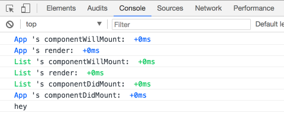

# React-yelling: handy debug react life cycle

  every time you wanna trace a component life cycle, so trivial the life cycle method need you define! That's `react-yelling` comes to the rescue.

# Quick start

```
import React from 'react'
import yell from 'react-yelling'

@yell()
class A extends React.Component {
  render() {
    return <div>Hello, World</div>
  }
}

export default A

```

# Screenshot



# Config

| param                     | type              | default | description                     |
| ---                       | ---               | ---     | ---                             |
| predicate                 | Boolean, Function | true    | yell or slience                 |
| componentWillMount        | Boolean           | true    | slience when false, same beblow |
| render                    | Boolean           | true    |                                 |
| componentDidMount         | Boolean           | true    |                                 |
| componentWillReceiveProps | Boolean           | true    |                                 |
| shouldComponentUpdate     | Boolean           | true    |                                 |
| componentWillUpdate       | Boolean           | true    |                                 |
| componentDidUpdate        | Boolean           | true    |                                 |
| componentWillUnmount      | Boolean           | true    |                                 |

```
@yell({
  // ...configs
})
class A extends Reactr.Component {
  // ... rest of code
```

# Developlement

leverage rollup to package this module

```
yarn dev
```

# Test

jest tests the react render correctly

```
yarn test
```

# License

MIT

